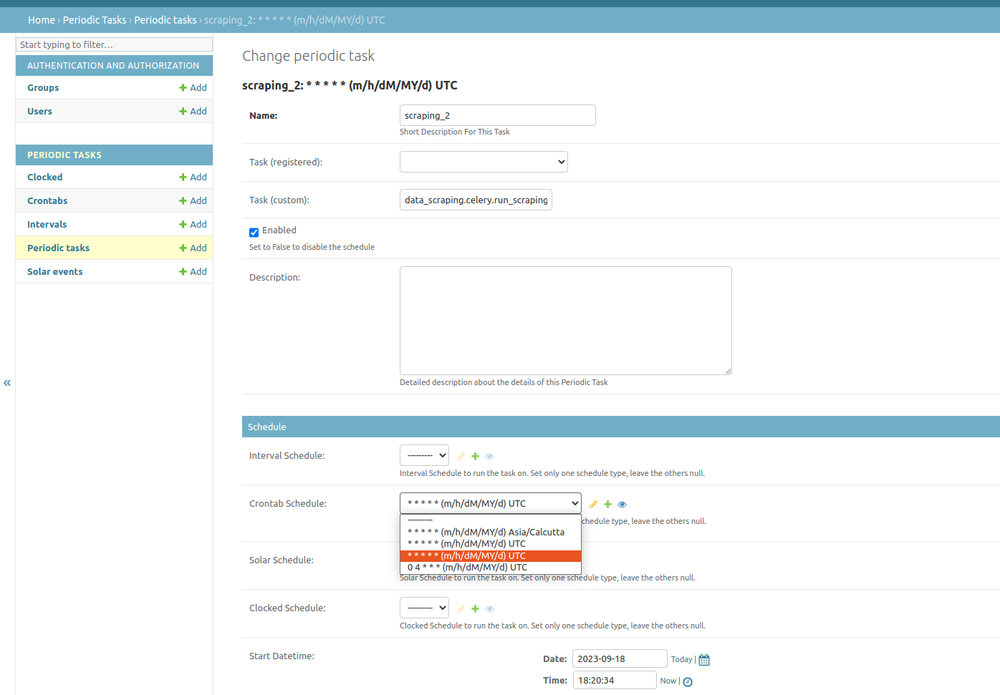

# 99 Acre's DATA SCRAPING

## Overview
A Django project that schedules and manages a property data scraping script. This script will scrape essential property details from the 99acres website, such as property name, cost, type, area, and individual property links. The scraping script will be scheduled to run twice daily for specific cities and localities using Django's cron job management. The scraped data will be stored in a MongoDB database.

## Tech Stack
Tools Used:
- framework: Django
- Databases: Mongo dB
- Scheduling:
    - Celery Beat & Celery

## Setup:
    a.	Clone the Git Repository to your system.
    b.	Open the new terminal and run the command bash setup.sh 
    c.	Open another new terminal and run the command docker-compose up
    d.	Go back to the previous terminal and run the command cd data_scraping
    e.	Then python manage.py runserver will run the server at port 8000

## Working:
    a.	When you run the command bash setup.sh, now everything is done automatically.
    b.	Firstly, it will make a virtual environment named Django. 
    c.	Then that virtual environment gets active, the command used is for Linux/Mac users and for Windows it is        
        django\Scripts\activate.bat
    d.	When the virtual environment is activated, it will install the required package for running this program.
    e.	After this open the new terminal and run docker-compose up command leave that terminal to run in the background.
    f.	Move back to the previous terminal and run cd data_scraping then run python manage.py runserver
    g.	The Django server get started at port 8000
    h.	The program will automatically store the data from 99acres.com twice a day from the cities listed below:
        i.	Pune, Maharashtra 
        ii.	Delhi, Delhi 
        iii.	Mumbai, Maharashtra 
        iv.	Lucknow, Uttar Pradesh 
        v.	Agra, Uttar Pradesh 
        vi.	Ahmedabad, Gujarat 
        vii.	Kolkata, West Bengal 
        viii.	Jaipur, Rajasthan 
        ix.	Chennai, Tamil Nadu 
        x.	Bengaluru, Karnataka
    i.	With the help of python modules Request and BeautifulSoup, program fetch the data from the site and make it in readable 
        form.
    j.	Then we find the data required from it and send that data which gets save in Mongodb database.

## Steps to get started
- Create virtual env
    - `python -m venv django`
- Active virtual env in each terminal `source django/bin/activate`
- Terminal 1
    - `docker-compose up`
- Terminal 2
    - `python manage.py migrate`
    - `python manage.py runserver`
- Terminal 3
    - `celery -A data_scraping beat -l INFO`
    - `celery -A data_scraping worker -l INFO`

## Special Features:
    a.	Docker compose: This will create a separator container that will run Mongodb and MySQL server on it.
    b.	setup.sh file: This file will automatically run the command written in it onto termial.
    c.	Constants file: This file consists of variables and their values that will never going to change

## E.g Scheduled Task
- Can be created/edited from admin interface
- 